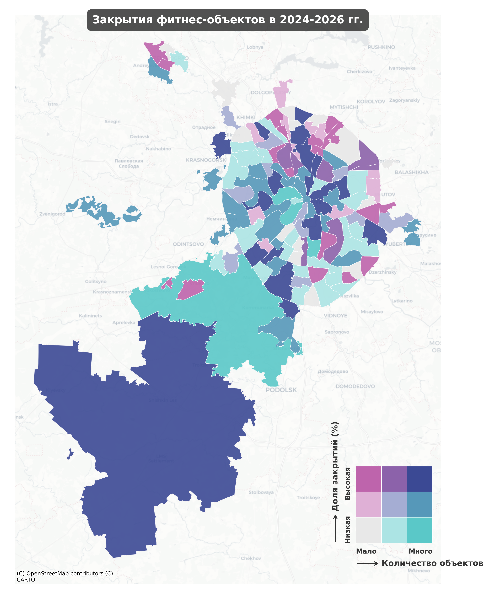

# Fitness Survival Analysis — Moscow

Дипломная работа: "Местоположение как фактор устойчивости открывающихся фитнес-объектов"

**Задача:** бинарная классификация — закроется ли фитнес-клуб в течение ~3 лет с момента открытия.  
**Модель:** CatBoost · **ROC-AUC = 0.7693** · 29 признаков · ранняя остановка на итерации 90/1000  
**Выборка:** 4 996 объектов · 9 временных срезов 2ГИС (август 2023 — март 2026)

---

## Структура репозитория

```
fitness_survival_analysis/
│
├── 2gis/
│   ├── poi/                        # Геоданные из 2ГИС
│   │    ├── beauty.csv             # Станции метро (координаты)
│   │    ├── bus.csv                # Автобусные остановки (координаты)
│   │    ├── cafe.csv               # Кафе (рейтинг, отзывы, координаты)
│   │    ├── cafe_checks.csv        # Средние чеки, вместимость кафе-ресторанов (координаты)
│   │    ├── coffee.csv             # Кофейни (рейтинг, отзывы, координаты)
│   │    ├── dental.csv             # Стоматологии (рейтинг, отзывы, координаты)
│   │    ├── hospital.csv           # Парки (рейтинг, отзывы, координаты)
│   │    ├── metro.csv              # Станции метро (координат)
│   │    ├── molls.csv              # Торговые центры (рейтинг, отзывы, этажность, количество заведений, координаты)
│   │    ├── parks.csv              # Парки (рейтинг, отзывы, координаты)
│   │    ├── pharma.csv             # Аптеки (рейтинг, отзывы, координаты)
│   │    ├── study.csv              # Учебные заведения (рейтинг, отзывы, координаты)
│   │    ├── supermarkets.csv       # Сетевые супармаркеты (рейтинг, отзывы, координаты)
│   │    ├── supermarkets4rich.csv  # Премиум и ЗОЖ-супермаркеты (рейтинг, отзывы, координаты)
│   │    └── workplaces.csv         # Офисы (рейтинг, отзывы, координаты)
│   │
│   ├── fitness/
│   │    ├── process_fitness.ipynb               # Агрегация данных фитнес-объектов, расчеты
│   │    ├── fitness_competitors_15ped_drive.csv # Данные с фитнесами и расчетами в изохрона
│   │    └── ...
│   │
│   │
│   ├── poi_structure.ipynb                      # Обработка выгрузок poi
│   ├── poi_iso.ipynb                            # Расчеты в изохронах для poi
│   ├── fitness_poi_iso5_15ped_15drive.csv       # Данные со всеми poi с расчетамии
│   └── ...
│
│
├── population/                                  # Обработка данных по населению и домам Москвы
│   ├── process_builds.ipynb                     # Расчеты в изохронах для населения всех домов
│   ├── fitness_pop_iso_15pop_15drive.csv        # Данные со всеми домами и населением с расчетами
│   ├── fitness_newbui_iso_15ped_drive.csv       # Данные со всеми новостройками с расчетами
│   └──  data/
│        │
│        └── ...
│  
│ 
├── real_estate/                                # Обработка данных по недвижимости и доходам в Москве
│   ├── process.ipynb                           # Объединение данных недвижимости и доходов
│   ├── fitness_realestate_iso_15ped_drive.csv  # Данные со всеми данными недвижимости и доходами с расчетами
│   ├── cian_rent_builds_11-01_2026.csv         # Цены аренды за м2, этажность, ... по домам Москвы в 2021 г.
│   ├── cian_buy_builds_23-03_2026.csv          # Цены продажи за м2, этажность, ... по домам Москвы в 2021 г.
│   ├── domclick_incomes.csv                    # Доходы и демография по домам Москвы 2025 г, агрегированные по населению
│   ├── moscow_builds_2021_price.csv            # Цены продажи за м2, этажность, ... по домам Москвы в 2021 г.
│   └──  data/
│        │
│        └── ...
│  
├── area/                                       # Классификация по площади и выделение услуг
│   ├── merging_predicting.ipynb
│   ├── fitness_features_with_areaclass.csv
│   └──  data/
│        │
│        └── ...
│ 
│  
├── park/                                       # Обработка данных по зеленым зонам Москвы, OSM
│   ├── process.py
│   ├── green_index.csv
│   └── ...
│ 
│  
├── cian/                                       # Парсеры Циан
│   └── ...
│
├── domclick/                                   # Парсер Домклик
│   └── ...
│
│
├── stats/                                      # Корреляции, значимость, закрытия по районам Москвы
│   ├── corr_data.xlsx
│   ├── shap-analysis.png
│   ├── shap-analysis.png
│   └── ...
│
│
├── maps/                                       # Карты закрытий
│   ├── bivariate_choropleth_districts_all.png
│   ├── hexbin_closure_rate_net.png
│   └── ...
│
│
├── df_all_features.xlsx            # Агрегированный дотаяет со всеми пространственными характеристиками по фитнесам
├── apartments.ipynb                # Обработка данных недвижимости и демографии
├── hypothesis.ipynb                # Проверка гипотез (Манн-Уитни, Спирмен)
├── aggregate_results.ipynb         # Агрегация признаков по изохронам
└── model.ipynb                     # Обучение моделей и анализ важности признаков
```

---

## Источники данных

| Источник | Что | Объём |
|---|---|---|
| **2ГИС** (парсинг) | Фитнес-объекты, 9 срезов по времени | 4 996 объектов |
| **2ГИС** (статика) | POI: метро, парки, кафе, ТЦ, офисы и др. | ~20 категорий |
| **ЦИАН** (апрель 2026) | Продажа квартир, цена/м², тип здания | 56 590 объявлений → 14 017 домов |
| **ЦИАН** (январь 2026) | Аренда квартир, цена/м² | 20 568 объявлений → 9 642 дома |
| **Домклик** (декабрь 2025) | Доходы жителей, ЖКУ, демография по домам | 9 088 домов |
| **Реформа ЖКХ** | Класс энергоэффективности зданий | — |
| **OSM / OSRM** | Изохроны 5 мин пешком, 15 мин пешком, 15 мин на авто | — |

---

## Пайплайн

```
Парсинг 2ГИС (9 срезов)
        ↓
Разметка целевой переменной is_closed
        ↓
Обработка, расчеты и агрегация Данных по фитнесам ← 2gis/fitness/process_fitness.ipynb
        ↓
Сбор внешних данных (ЦИАН, Домклик, Kaggle, ЖКХ, POI 2ГИС, OSM)
        ↓
Построение изохрон → агрегация признаков          ← apartments.ipynb, 2gis/poi_iso.ipynb, population/process_builds.ipynb                                        
        ↓
Проверка гипотез                                  ← hypothesis.ipynb
        ↓
Отбор признаков (pre-entry filter + VIF/корреляции)
        ↓
Обучение CatBoost / Random Forest                  ← model.ipynb
        ↓
Feature Importances, SHAP
```

---

## Решения

**Проблема информационной асимметрии.** Самые значимые признаки (рейтинг, число отзывов, динамика цен абонемента) недоступны для нового, ещё не открытого клуба. Все такие переменные исключены — модель работает только на признаках, известных *до открытия*.

**Два блока признаков:**
- **Блок A** — рассчитываются автоматически по изохронам для любой точки: население, транспорт, конкуренты, недвижимость, инфраструктура.
- **Блок B** — вводятся владельцем: цена абонемента, тип объекта, набор услуг, статус сети, наличие сайта.

**Редукция мультиколлинеарности.** Из каждой группы сильно скоррелированных признаков (r > 0.85) оставлен один — наиболее интерпретируемый и простой в сборе.

---

## Топ-5 факторов выживаемости

| Признак | Важность | Смысл |
|---|---|---|
| `net` | 19.5% | Принадлежность к сети |
| `content_trainings` | 13.7% | Наличие групповых тренировок |
| `subs_month` | 7.1% | Цена месячного абонемента |
| `metro` | 6.8% | Метро в пешей доступности |
| `content_class_area` | 6.6% | Большой тренировочный зал |

---

## Метрики модели

| Порог | Precision (класс 0) | Recall (класс 0) | Ложных одобрений / 1000 |
|---|---|---|---|
| 0.40 | 90.2% | 51.6% | 39 |
| **0.50** | **88.0%** | **61.1%** | **58** |
| 0.60 | 80.7% | 80.2% | 134 |

---

<div style="text-align: center;">
    
</div>

<div style="text-align: center;">
    
</div>

## Стек

```
Python 3.11 · pandas · geopandas · scikit-learn · catboost
requests · curl_cffi · selenium · playwright · beautifulsoup4
scipy · matplotlib
```
